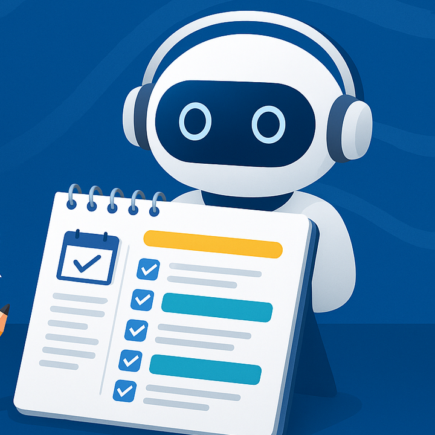
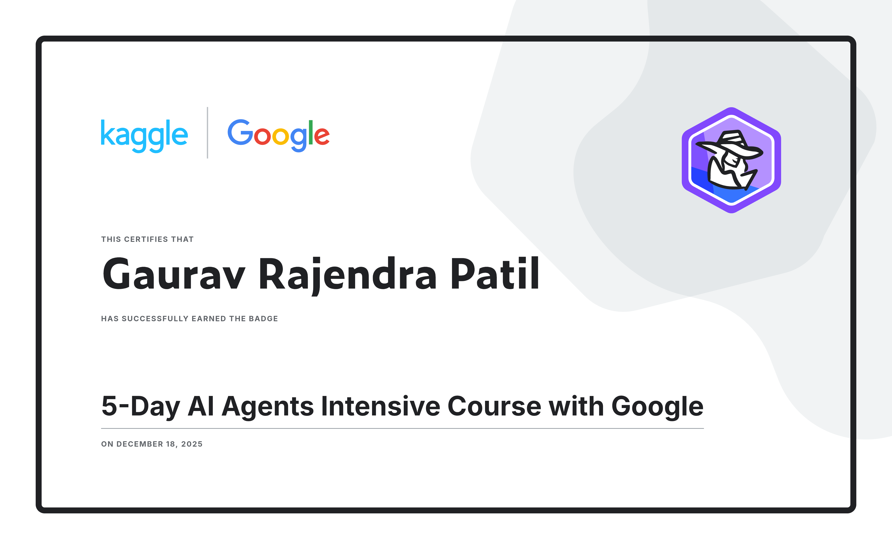

  

<h1 align="center">🎓 Smart Study Planner – AI Concierge Agent</h1>

  🚀 An AI-powered study planning agent built for the Kaggle Agents Intensive Capstone Project  

  
  
  
  

---

## 🧠 About This Project

**Smart Study Planner – AI Concierge Agent** is a **Python-based AI agent** that helps students create a **structured daily study plan** using **tools, memory, and context engineering**.

The agent simulates a real AI workflow by:
- remembering user preferences  
- calling custom tools  
- generating clean and readable study schedules  

This project was developed as part of the **Kaggle Agents Intensive – Capstone Project**.

---

## 🎯 Problem Statement

Students often face problems such as:
- ⏳ Not knowing how much time to give each subject  
- 📚 Difficulty balancing multiple subjects  
- 🗂 Inconsistent daily schedules  
- ❌ Manual planning that is time-consuming  

---

## 🚀 Solution Overview

The **Smart Study Planner Agent** solves these problems by:
- Automatically dividing available study hours
- Using memory to store user preferences
- Generating a clean and structured timetable
- Simulating intelligent agent reasoning and tool usage

---

## 🔧 Key Features

- 🛠 **Custom Tooling** – Generates daily study plans from subjects & available hours  
- 🧠 **Memory System** – Stores user name, subjects, hours, and past plans  
- 🧩 **Context Engineering** – Uses compact summaries for efficiency  
- 📊 **Observability** – Logs showing step-by-step agent behavior  
- 🤖 **Multi-Agent Ready** – Motivation agent can be added  
- 📘 **Structured Output** – Clean, readable timetable format  

---

## ⚙️ How the Agent Works

User Input
↓
Planner Agent
↓
Study Allocation Tool
↓
Memory Handler
↓
Final Study Plan Output

---

## 🛠 Technologies Used

| Technology | Purpose |
|----------|--------|
| Python | Core agent logic |
| Custom Tools | Study time allocation |
| Memory Simulation | User preference storage |
| Context Engineering | Efficient conversations |
| Logging / Tracing | Agent observability |

---

## 🏆 Certification

  

**Kaggle – 5 Day AI Agents Intensive Course with Google**  
Capstone Project Submission (2025)

---

## 🔮 Future Enhancements

- 🧠 Long-term memory for tracking study progress  
- 🚀 Deployment using Vertex AI Agents  
- 🎙 Voice-based study commands  
- 📊 Adaptive learning recommendations  
